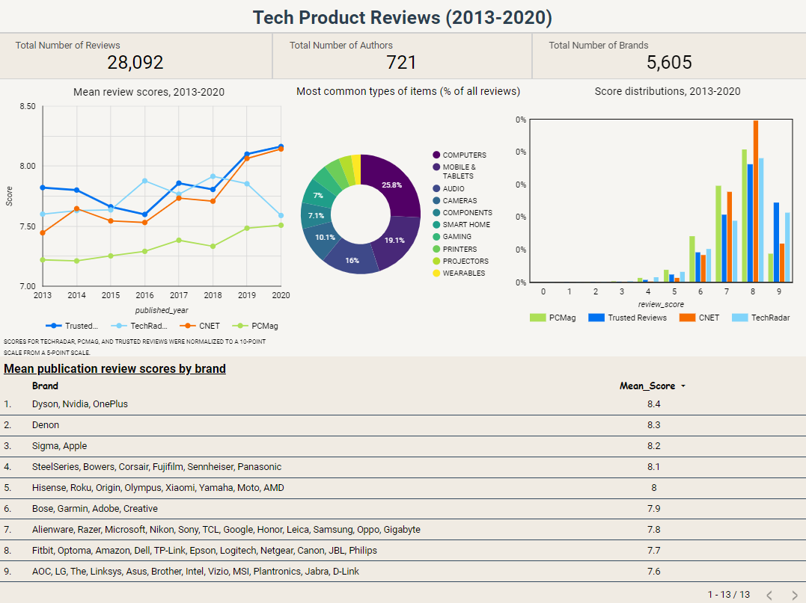

# Tech Product Reviews

## Project Description

This project is part of the [Data Engineering Zoomcamp](https://github.com/DataTalksClub/data-engineering-zoomcamp) for 2024 Cohort. 
This project contains an end-to-end data pipeline written in Python. 


**Data** 

The project used the data from [Components](https://components.one/datasets/tech-reviews-dataset), which consists of 28,000 product reviews from PCMag, CNET, Tech Radar and Trusted Reviews, covering the period from the beginning of 2013 to the end of 2020. The data is approximately 212 MB in size. The dataset comprises various attributes such as product score, article URL, text, title, author, date, and product category when applicable. 

> **Disclaimer:** The datasets used for this project are relatively smalls datasets. The main idea of this project wasn't to deal with a big dataset at this point, but rater build a pipeline that can fetch, organize and transform present data. But above all, to answer some questions that arose during the formulation of the problem.

**Pipeline description:**
1. Pipeline fetches the data from online source
2. It then conducts a basic transformation on the dataset and uploads it to Google Cloud Storage
3. The data is then loaded from GCS, fully tranformed and then upload to BigQuery in the form of tables
4. The tables are created using partitioning and clustering for better query performace 

Steps 1-3 are orchestrated in [Mage](https://docs.mage.ai/introduction/overview)

**Goal**
The examination aims to discern patterns within product reviews across diverse publications. It's valuable to ascertain which brands receive higher average scores in these reviews. Additionally, we seek to track the evolving popularity of product categories over time and to identify key authors contributing to tech reviews.

## Tools

1. **Cloud:**
   
   - [Google Cloud Platform (GCP)](https://cloud.google.com/?utm_source=bing&utm_medium=cpc&utm_campaign=latam-AR-all-es-dr-BKWS-all-all-trial-e-dr-1707800-LUAC0016410&utm_content=text-ad-none-any-DEV_c-CRE_-ADGP_Hybrid+%7C+BKWS+-+MIX+%7C+Txt_+GCP-General-KWID_43700067403123893-kwd-77859523038025:loc-8&utm_term=KW_Google+Cloud+Platform-ST_Google+Cloud+Platform&gclid=f110f2a74b1b1da673c894aa2e0948fa&gclsrc=3p.ds&hl=en)
   
   - [Terraform (IaC)](https://www.terraform.io/) - Employed for provisioning GCP services such as Buckets and BigQuery Tables


2. **Data Ingestion (batch):**
   
   - [Mage](https://www.mage.ai/) - Employed for workflow orchestration. Utilized for fetching data via API, transforming the data, and subsequently converting the data to parquet files and loading it into GCP buckets, followed by integration with BigQuery

3. **Data Lake:**
   
   - [Google Cloud Storage](https://cloud.google.com/storage?hl=en) - Used for storing parquet files

4. **Data Warehousing:**
   
   - [Google BigQuery](https://cloud.google.com/bigquery?hl=en) - Data was stored in tables, with a new table created by implementing partitioning and clustering on the original data to enhance query performance

5. **Data Transformations and Processing:**
   
   - [dbt](https://www.getdbt.com/) - Utilized as an analytical platform for crafting data models using SQL sourced from BigQuery. The process involved the creation of multiple new tables, facilitating the discovery of novel insights 

6. **Dashboarding:**
   
   - [Google Looker Studio](https://lookerstudio.google.com/overview) -Employed for data visualization, facilitating the extraction of key insights through visual representation.

### Architecture


### Key Insights

Check out the interactive dashboard [***HERE***](https://lookerstudio.google.com/u/0/reporting/63c86e19-0fdc-4f5d-98e3-0b04281c30e6).

After analyzing data from the year 2013 to 2020, it can be said that:

1. The average product review score across all four publications exceeded 7 on a scale of 1 to 10

2. Computers, including laptops, PCs, and monitors, garnered the highest number of reviews

3. Dyson, Nvidia, OnePlus, Denon, Sigma, and Apple products emerged as top-reviewed items


---

### Folder navigation

#### `./code`

**- tech_reviews_exploration.ipynb**

Notebook with Python script for data exploration.

**- tech_reviews_queries.sql**

SQL queries for create tables in BigQuery before dbt use.

#### `./data`

**- tech-review.zip**

The zip file contains the dataset used for analysis

#### `./dbt`

Sub folders and files for the whole dbt project.

#### `./images`

Various images of mage pipelines and dbt models, among other things


#### `./visualization`

Dashboard resulting from the design in looker studio and access link.

#### `./mage`

Sub folders and files for the whole mage project.

#### `./terraform`

**- main.tf**

Main configuration file for Terraform, defining the infrastructure as code to provision (or destroy) all the necessary resources in the cloud.

**- variables.tf**

File containing variable definitions used in the main Terraform file (main.tf), facilitating code customization and reuse.


## Getting Started Guide

### Prerequisites
1. [Docker](https://docs.docker.com/engine/install/) and [Docker compose](https://docs.docker.com/compose/install/)
2. [Git](https://git-scm.com/book/en/v2/Getting-Started-Installing-Git)
3. [Terraform](https://developer.hashicorp.com/terraform/install)
4. [GCP account](https://cloud.google.com/)

Before running the code you need to follow the steps below

### Setting up GCP

To set up Google Cloud Platform (GCP), follow these steps:

1. **Create a GCP Account:** Sign up for a GCP account [here]((https://cloud.google.com/)). Note that even though there's a trial option, you'll still need a credit card for signup.
2. **Create a New Project:** Once logged in, navigate to the GCP Console and create a new project. Give it a suitable name and make a note of the project ID.
3. **Create a service account:**

   - In the left sidebar, click on "IAM & Admin" and then "Service accounts."

   - Click "Create service account" at the top.

   - Enter a name and optional description for your service account.

   - Select roles like BigQuery Admin, Storage Admin, and Compute Admin for this project.

   - Click "Create" to make the service account.

   - After creation, download the private key file. This file is used to authenticate requests to GCP services.

   - Click on the service account to view its details, then navigate to the "Keys" tab and click "Add Key." Choose "JSON" as the key type and click "Create" to download the private key file.

   - Store this JSON key file and rename it to mage-zoomcamp-key.json, placing it in the root level of Mage directory of your project.

4. **Enable BigQuery API:** Ensure that the BigQuery API is enabled by going to the BigQuery API and enabling it [here](https://console.cloud.google.com/apis/library/browse?hl=sv&project=air-quality-project-417718&q=bigquery%20api)

---
### Running the code
To run the code on macOS/Linux/WSL, follow these steps:

1. **Clone Repository**: Clone the repository to your local machine.

2. **Navigate to Terraform Directory:** Use the terminal to navigate into the terraform directory. Here, we use Terraform to create Google Cloud resources. If necessary, modify the region to your local region in the `variables.tf` file, and update the `project ID` to match the one created in GCP.

3. **Initialize Terraform:** Run `terraform init` to prepare your working directory containing congiguration files and install plugins for required providers.


4. **Plan Changes:** Run `terraform plan` to show changes required by the current configuration.

5. **Apply Changes:** Execute `terraform apply` to create or update infrastructure based on the Terraform configuration.

6. **Destroy Infrastructure:** If needed, run `terraform destroy` to remove previously-created infrastructure (use with caution).

7. **Navigate to Mage Directory:** `cd` into the mage directory.

8. **Build Docker Container:** Run `docker-compose build` to build the Docker container.

9. **Start Docker Container:** Execute `docker-compose up` to start the Docker container.

10. **Access Mage Repository:** You've initialized a Mage repository named tech-reviews. Access it at http://localhost:6789 in your browser.

This repository should have the following structure:

```
.
├── mage_data
│   └── tech-reviews
├── tech-reviews
│   ├── __pycache__
│   ├── charts
│   ├── custom
│   ├── data_exporters
│   ├── data_loaders
│   ├── dbt
│   ├── extensions
│   ├── interactions
│   ├── pipelines
│   ├── scratchpads
│   ├── transformers
│   ├── utils
│   ├── __init__.py
│   ├── io_config.yaml
│   ├── metadata.yaml
│   └── requirements.txt
├── .gitignore
├── .env
├── docker-compose.yml
├── Dockerfile
└── requirements.txt
```
11. Go to the browser, find **pipelines**, you will see two pipelines, namely `api_gcs` and `gcs_to_bigquery`. You can run the pipelines sequentially.

12. Utilize the 'tech_reviews_queries.sql' file located within the './code' directory to generate supplementary tables in BigQuery, incorporating partitioning and clustering for enhanced data efficiency

Once the process is completed, you should possess a `parquet` file stored in Google Cloud Bucket Storage, alongside a transformed table within BigQuery. Your pipeline should resemble the following structure.

<table><tr>
<td> </td>
<td>  </td>
</tr></table>

---

### Analytics Engineering with dbt

The objective is to convert the data stored in the Data Warehouse (Google BigQuery) into Analytical Views through the development of a dbt project. At this juncture, you should have accomplished the following:

- Established a functional warehouse (BigQuery)
- Implemented a series of operational pipelines for ingesting the project dataset (Mage)
- The datasets from `./data` ingested into GCS in a *.parquet* format

##### Setting up dbt for using BigQuery (cloud)

- Register for a free developer account on dbt cloud by accessing [this link.](https://www.getdbt.com/signup/)

- Utilize the provided instructions to establish a connection with your BigQuery instance.

- For comprehensive guidelines, refer to the detailed instructions available [here](https://github.com/DataTalksClub/data-engineering-zoomcamp/blob/main/04-analytics-engineering/dbt_cloud_setup.md).

The transformation lineage is documented within the `./dbt/models` directory, and look like the following


<br>
<br>

--- 

### Creating Visualizations

- Log in to [Google looker studio](https://lookerstudio.google.com/navigation/reporting) with your Google account.

- Connect your dataset using the BigQuery Connector.

- Choose your project name and then select the dataset. This action will navigate you to the dashboard page.

- Proceed to create your visualizations and share them as needed.


<br>
<br>

--- 

### Contribution

Contributions to the pipeline are welcome! Please fork the repository, make your changes, and submit a pull request for review.


